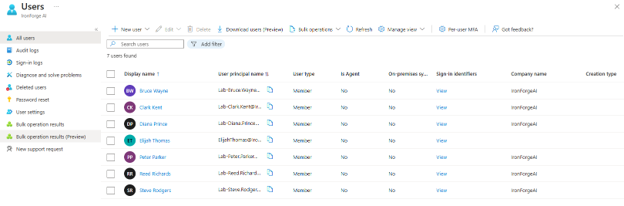
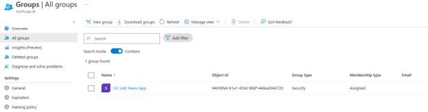
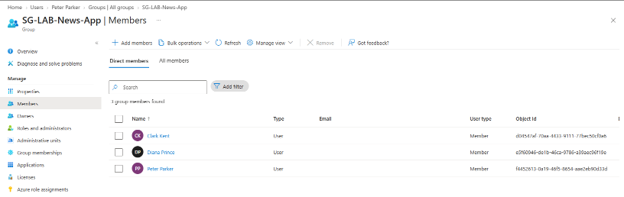

# Post 7 -- Entra ID Tenant + Identity Fundamentals

## What I did

- Signed in to the Microsoft Entra admin center (entra.microsoft.com) with the IronForge AI admin account.

- Created test users under Identity > Users, prefixed Lab- to keep them distinguishable from real IronForge AI accounts:

    - Lab-Bruce.Wayne@IronForgeAI.onmicrosoft.com -- Executive Branch

    - Lab-Clark.Kent@IronForgeAI.onmicrosoft.com -- Editorial

    - Lab-Diana.Prince@IronForgeAI.onmicrosoft.com -- Public Relations

    - Lab-Peter.Parker@IronForgeAI.onmicrosoft.com -- Editorial

    - Lab-Reed.Richards@IronForgeAI.onmicrosoft.com -- Research

    - Lab-Steve.Rodgers@IronForgeAI.onmicrosoft.com -- Security

- Created a Security group under Identity > Groups:

    - Name: SG-LAB-News-App

    - Description: Group that holds the News, Outreach, Public Roles

    - Membership type: Assigned -- manual control over who's in it; this lab isn't using dynamic membership rules.

    - Microsoft Entra roles can be assigned to the group: No -- this is a resource group for an access package, not a role-assignable / PIM-for-Groups group.

    - Members: Lab-Diana.Prince, Lab-Clark.Kent, Lab-Peter.Parker

## Screenshots

## Why it matters

This is the identity foundation the rest of the IGA lab builds on -- Post 8's access package grants membership to this group, Post 9's access review audits who still has it, and Posts 10-11 carry the same governance model into midPoint on-prem. Reusuing an existing licensed tenant (IronForgeAI) instead of standing up a throwaway sandbox also mirrors a real constraint IAM analysts run into day to day: working inside production tenants. 
