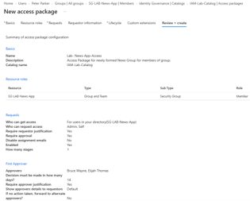

## What I did
- Created a catalog under ID Governance > Entitlement management > Catalogs,
  and added the Post 7 security group to it as a resource.
- Built a new access package on top of that resource:
  - Resource roles: the group, "Member" role
  - Requests: open to users in the directory, requires approval from a
    designated approver
  - Lifecycle: expires after 30 days, with the option to request an extension
 
## Screenshot

 
## Why it matters
This is the piece that replaces "someone emails IT and access gets granted
forever" with an actual governed, time-boxed process that has an approval
step and an audit trail — the core of what "entitlement management" means
in an IGA role. Post 9 builds the recurring access review on top of this
same package.

