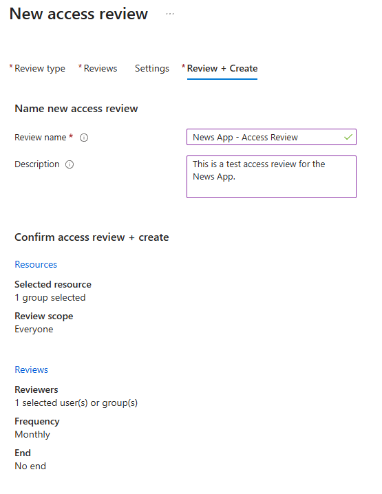
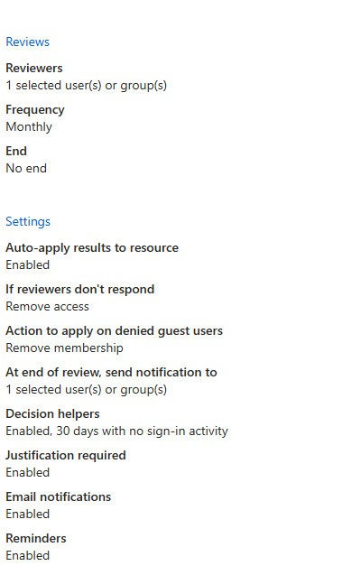
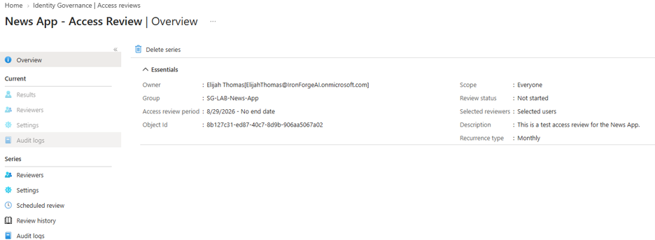
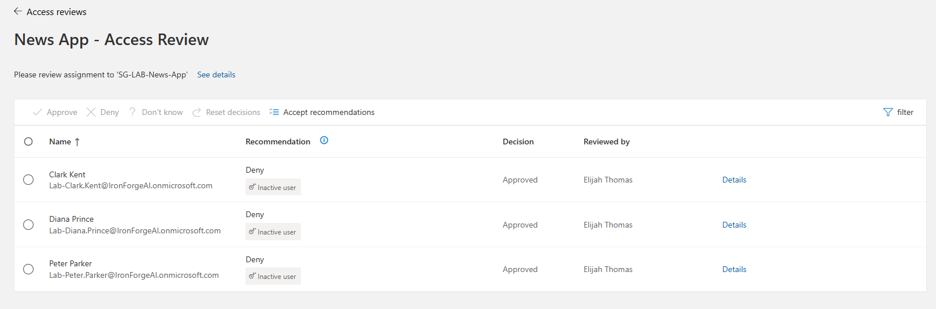

# Post 9 — Access Reviews
 
## What I did
- Configured a recurring access review against the Post 8 access package.
- Review recurs monthly, reviewer is a designated test user (or self), with
  auto-apply enabled so decisions (e.g. "deny") automatically remove access
  when the review closes.
- Navigated to myaccess.microsoft.com, signed in as a review [myself]
- Walked through one review cycle as the reviewer and recorded the result.
 
## Screenshot

 
## Why it matters
An access package controls how someone gets access; an access review is
what proves they still need it. This recurring audit trail turns "we granted
access once" into "we can demonstrate access is still appropriate" — the
actual point of IGA, and the step most orgs skip after initial provisioning.

