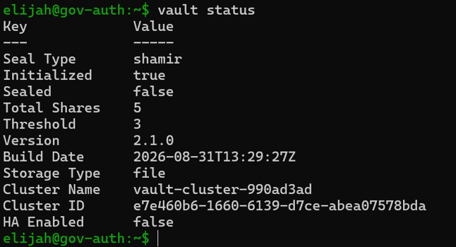
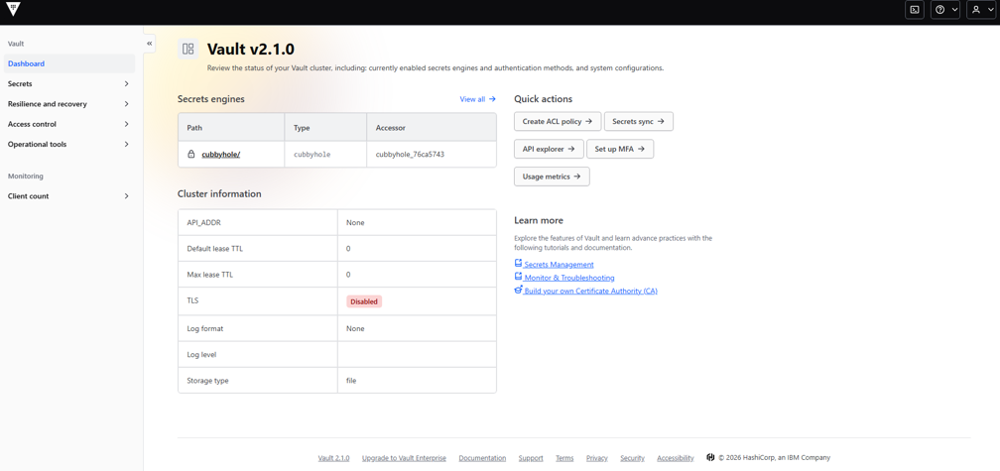

# Post 12 — Vault Installed & Initialized

## What I did
- Installed HashiCorp Vault from the official RPM repo on gov-auth.
- Configured a single-node, file-storage backend with the UI enabled (noted in-line
  that production would use Raft storage, TLS, and auto-unseal instead).
- Ran `vault operator init`, saved the 5 unseal keys and root token to a password
  manager (not the repo), and unsealed Vault with 3 of the 5 keys.
- Confirmed `vault status` reports Sealed: false, and logged in with the root token.

## Screenshots

## Why it matters
Vault is the open-source PAM engine this whole lab is built on — the same category of
tool as CyberArk or Delinea, just without the enterprise license. Getting it installed,
initialized, and unsealed correctly (and understanding what the unseal keys/root token
actually protect) is the prerequisite for every PAM concept the rest of this lab
demonstrates: credential vaulting, just-in-time access, and least privilege.

