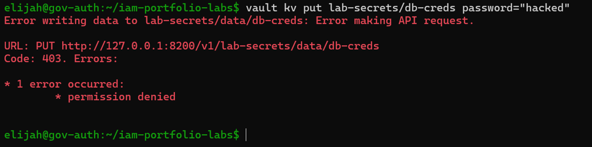

# Post 13 — Secrets + Least Privilege

## What I did
- Enabled Vault's KV v2 secrets engine at a dedicated path (lab-secrets), stored a sample
  credential pair, and retrieved it back via the CLI.
- Wrote a Vault policy (readonly-app) granting read/list only on that path, and issued a
  token scoped to that policy.
- Confirmed the restricted token could read the stored secret but was denied when
  attempting to write to it — permission denied as expected.

## Screenshot

## Why it matters
Storing a secret in Vault is only half the story — a vault full of secrets that anyone
with a token can read and overwrite isn't actually secure. The denial in this screenshot
is the point: least privilege isn't a slide in a deck, it's a policy that actually stops
someone from doing more than their role allows, enforced by Vault at the API level.

