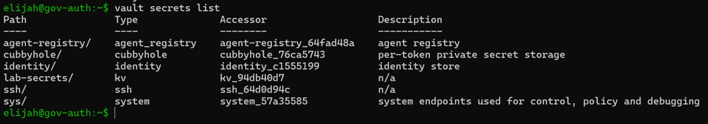
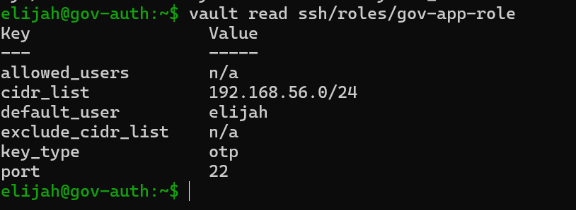
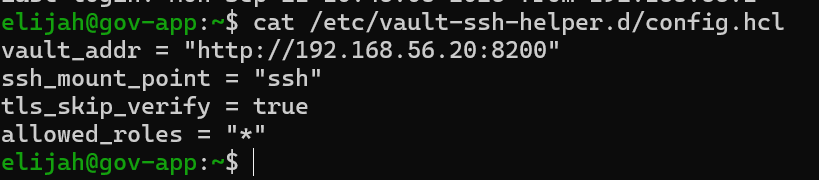
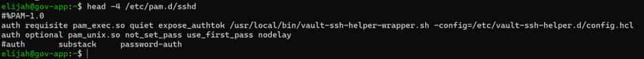
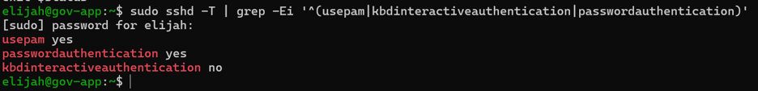
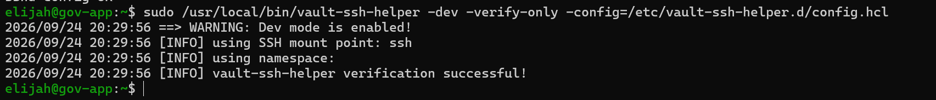
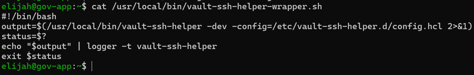
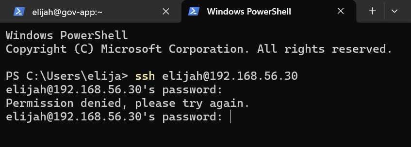
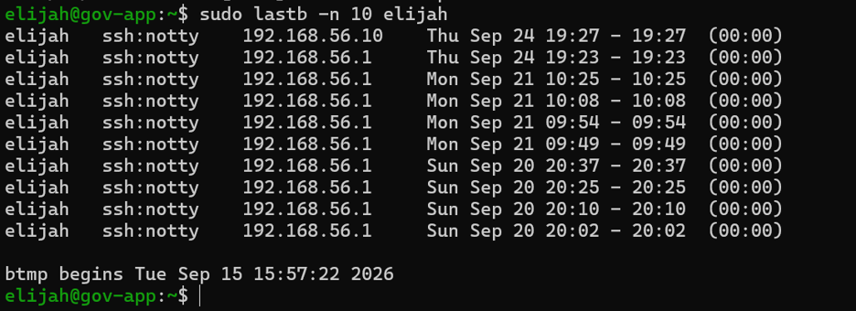
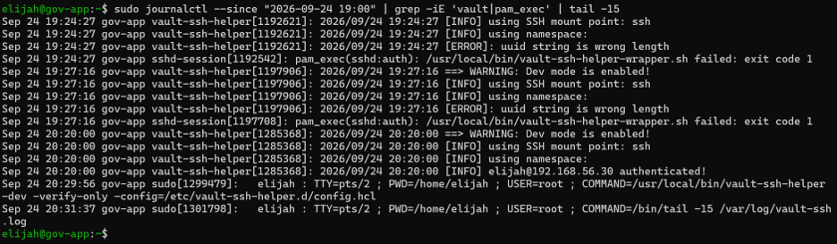

# Post 14 — Just-in-Time SSH: Wiring Vault into the Linux Login

## What I built
- Enabled Vault's **SSH secrets engine** (`ssh/`) on gov-auth and created `gov-app-role`: OTP credentials only, `default_user = elijah`, limited to the `192.168.56.0/24` lab subnet.
- Installed **vault-ssh-helper** on gov-app and placed it **first** in the sshd PAM auth stack (`/etc/pam.d/sshd`) as `requisite`. Every SSH login now has to present a one-time password that Vault issued, and a normal account password fails at the first check.
- Verified the helper can reach Vault and the SSH mount (`-verify-only` → `verification successful`), and confirmed the sshd config passes `sshd -t`.

## As-built vs. the build guide
Reviewing the live config against my guide turned up three differences, and I documented each one instead of assuming the guide still matched the box:

| Guide | As built on gov-app | Effect |
|---|---|---|
| PAM calls `vault-ssh-helper -dev` directly with `log=/var/log/vault-ssh.log` | PAM calls `vault-ssh-helper-wrapper.sh`, which runs the helper, pipes its output to syslog with `logger -t vault-ssh-helper`, and passes the helper's exit code back to PAM | Helper decisions land in the system journal (`journalctl`), so `/var/log/vault-ssh.log` stays empty |
| `auth substack password-auth` left active | Commented out | No fallback to the local password over SSH. Only a Vault OTP gets in |
| Enable `ChallengeResponseAuthentication yes` | Not set. `sshd -T` shows `passwordauthentication yes`, `kbdinteractiveauthentication no`, `usepam yes` | The OTP is typed at the normal password prompt and still goes through PAM, so the helper sees it via `expose_authtok` |

## What broke / proof the control works
- **Symptom:** SSH to gov-app kept returning `Permission denied` with my normal password, including 22 failed attempts between Sept 15 and Sept 21 and more today from both my Windows host (`192.168.56.1`) and gov-admin (`192.168.56.10`).
- **Cause:** by design. The helper runs first as `requisite`, and a regular password isn't a Vault OTP. The journal shows the helper rejecting it (`[ERROR]: uuid string is wrong length`) and PAM stopping the login (`pam_exec … failed: exit code 1`).
- **Fix:** request an OTP from Vault (`vault write ssh/creds/gov-app-role ip=192.168.56.30`) and enter it at the password prompt.
- **Verification:** the journal logs `[INFO] elijah@192.168.56.30 authenticated!` and the session opens.

**Worth noting:** Vault gates **SSH logins only**. `sudo` on gov-app still uses the account's own password through `/etc/pam.d/sudo`, so remote access and local privilege escalation stay separate control points.

## Known lab shortcuts (not how I'd run production)
- **Plain HTTP:** Vault listens on plain HTTP, so the helper runs with `-dev` and `tls_skip_verify = true`. Production would use TLS with a trusted CA and drop `-dev`.
- **Long-lived OTPs:** `gov-app-role` has no TTL, so an issued OTP that nobody uses stays valid for the 768h default. It's still single-use, but it should expire in minutes (`ttl=15m`).
- **Shared role:** one role for everyone, so revocation can't target one person. Per-identity roles or signed SSH certificates would fix that (Post 15 covers revocation).

## Why it matters
This is the point where Vault stops being an API I call and starts actually gatekeeping a real Linux login. The most useful part was checking the live system against my own documentation. The as-built config had drifted from the guide in three places, and finding and explaining drift like that is day-to-day work in access management.
